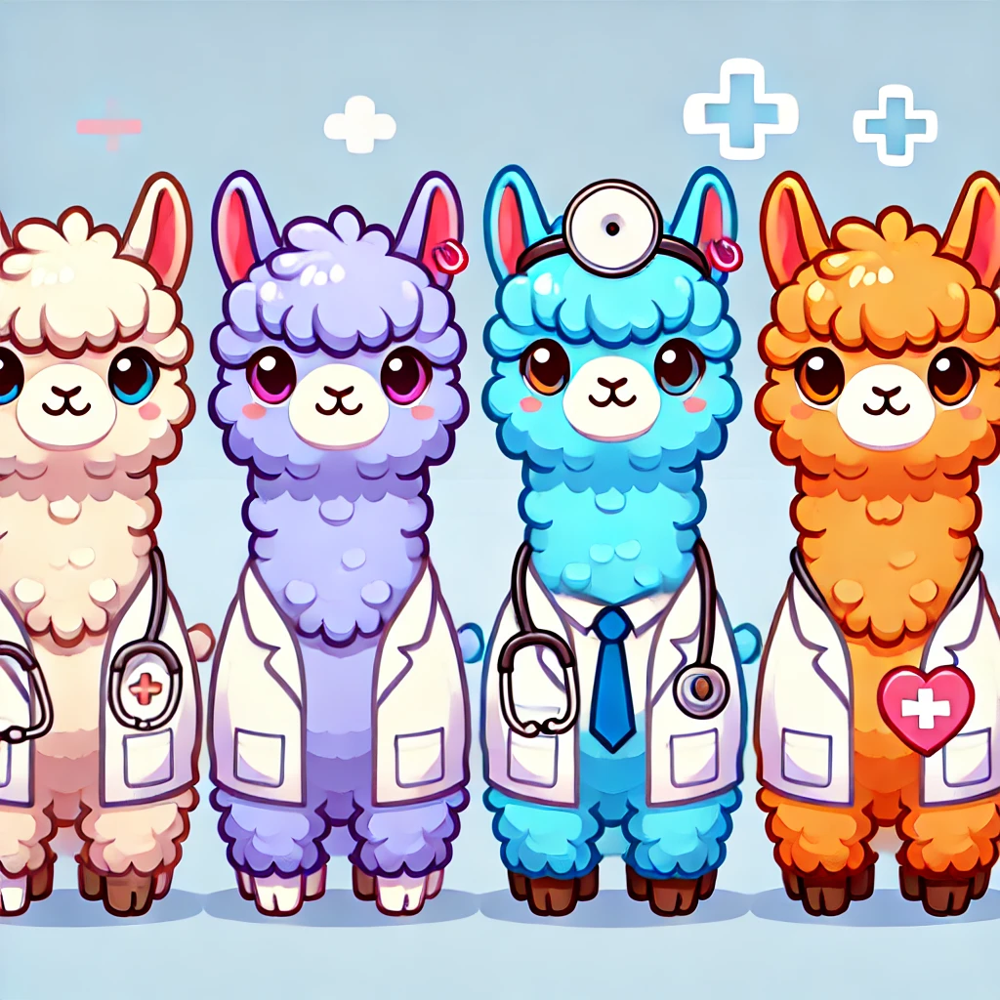
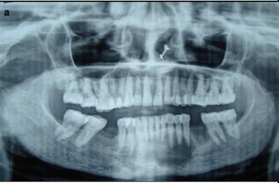

<p align="center">
    
<p>


<h1 align = "center">
HealthGPT
</h1>

## 💬 Introduction
This project utilizes enhanced visual and linguistic methods to improve the performance of medical large models in multimodal and complex task scenarios, which we call **HealthGPT**.

## 🧩 Base Model
We will refine the repository as soon as possible so that you can use the base models along with our provided code and data for reproduction. 

Here are the base models used in HealthGPT:
| Model Type | Model Name | Download       |
|:------------:|:------------:|----------------|
| ViT        | Clip-Vit-Large-Patch14-336       | [Download](https://huggingface.co/openai/clip-vit-large-patch14-336)  |
| LLM |Llama-3-8B-Instruct |[Download](https://huggingface.co/meta-llama/Meta-Llama-3-8B-Instruct) |

Later, we will provide the trained weights and the complete model structure.

## 🛠️ Environment Installation and Download
```bash
conda create -n HealthGPT python==3.10.13
conda activate HealthGPT
pip install -r requirements.txt
```

## 🤗 Demo

### Model
We will update the HealthGPT weights and inference scripts as soon as possible.

### Case
<p align="center">
    
<p>

```
Human: Describe the image in detail.

HealthGPT: The image is a panoramic X-ray of the maxillofacial region, clearly displaying both the upper and lower jaws, including all teeth. The X-ray shows a distinct outline of the maxillary and mandibular bones, with clear visibility of the tooth roots. The image also reveals the presence of dental restorations, such as fillings and crowns, which appear as unique, radiopaque structures. The overall skeletal structure is intact, with no visible fractures or other abnormalities. This image provides a comprehensive view of the dental and skeletal anatomy, enabling a thorough assessment of the patient's oral health.
```

## 🧾 Dataset

### Data Template
```bash
{
    "image": [
        "img1_path",
        "img2_path"
    ],
    "conversations": [
        {
            "from": "human",
            "value": "<image>\n<image>\nSentence1."
        },
        {
            "from": "gpt",
            "value": "Sentence2."
        },
        {
            "from": "human",
            "value": "Sentence3."
        },
        {
            "from": "gpt",
            "value": "Sentence4."
        }
    ]
}
```

We will provide the complete training data later.