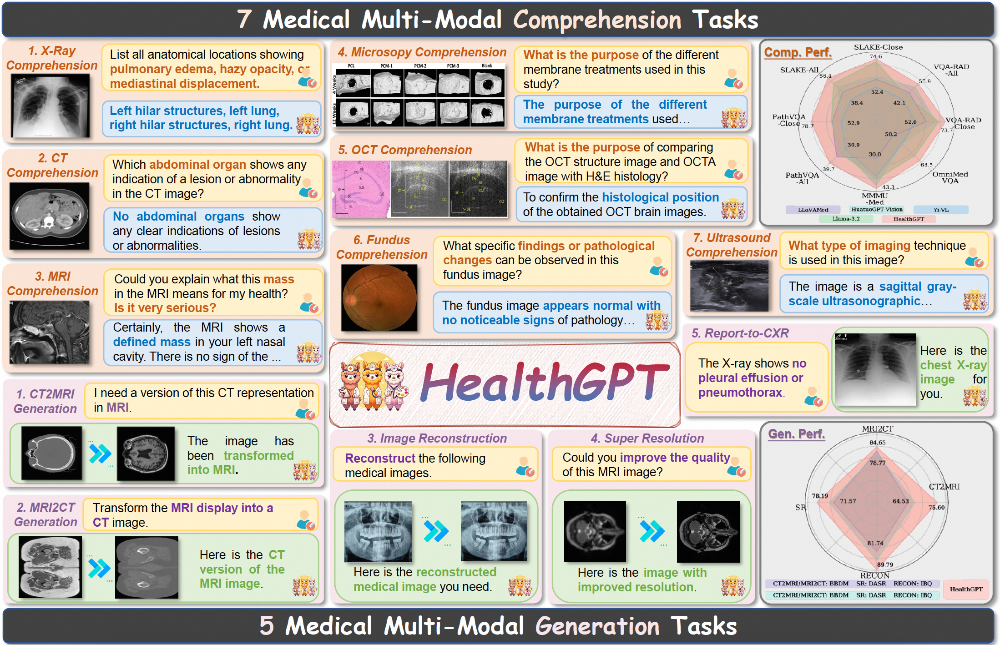
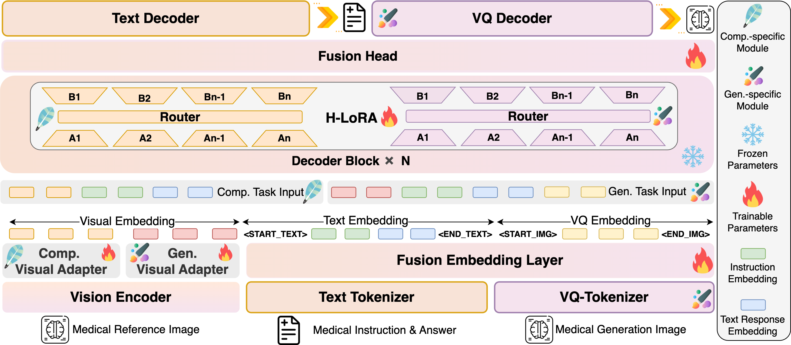

<div align="center">

# HealthGPT Series

<p>
  <a href="./HealthGPT-Pro/README.md"></a>
  <a href="https://lin-tianwei.github.io/healthgpt-pro.github.io/"></a>
  <a href="https://huggingface.co/lintw/HealthGPT-Pro-4B"></a>

  <a href="./HealthGPT/README.md"></a>
  <a href='https://llsuzy.github.io/HealthGPT.github.io/'></a>
  <a href='https://arxiv.org/abs/2502.09838'></a> 
  <a href='https://huggingface.co/lintw/HealthGPT-M3'></a>

</p>

</div>

**HealthGPT Series** is a medical multimodal large language model (MLLM) family composed of two subrepositories:

- [**HealthGPT-Pro**](./HealthGPT-Pro/README.md): a high-performance MLLM for **medical understanding and analysis**, supporting medical **text**, **2D images**, and **3D volumes**.
- [**HealthGPT**](./HealthGPT/README.md): a unified MLLM for **medical comprehension and generation**, built around heterogeneous knowledge adaptation.

Together, the series covers both:

- a **strong unified generation + comprehension framework** in HealthGPT, and
- a **new flagship understanding model** in HealthGPT-Pro with broader modality support and stronger benchmark performance.

### 🚀 From HealthGPT to HealthGPT-Pro

Compared with **HealthGPT**, **HealthGPT-Pro** substantially advances medical understanding capabilities:

| Aspect | HealthGPT | HealthGPT-Pro |
| --- | --- | --- |
| **Supported modalities** | 8 modalities | 14 modalities |
| **Training data scale** | ~1.5M samples | ~13M samples |
| **Capability scope** | Medical images | Medical text, 2D medical images, and 3D medical volumes |
| **Benchmark standing** | Strong unified medical LVLM | State-of-the-art medical understanding performance |

This makes **HealthGPT-Pro** a significant upgrade for medical understanding tasks while **HealthGPT** remains the foundation for unified medical comprehension and generation research.

## 📢 News

- **[2026-05-02]** 🎉🎉🎉 We present [**HealthGPT-Pro**](https://lin-tianwei.github.io/healthgpt-pro.github.io/), a high-performance multimodal large language model for medical understanding and analysis, trained on large-scale data (**3M** CPT and **10M** SFT), enabling unified reasoning over medical text, 2D images, and 3D volumes.
- **[2025-05-02]** 🎉🎉🎉 [**HealthGPT**](https://arxiv.org/abs/2502.09838) was accepted by **ICML 2025** as a Spotlight presentation.
- **[2025-03-20]** We upgraded our specialized comprehension model, [**HealthGPT-XL32**](https://huggingface.co/lintw/HealthGPT-XL32), which significantly outperforms HealthGPT-L14 with a score of **70.4** versus **66.4**.
- **[2025-03-06]** We released the [**VL-Health**](https://huggingface.co/datasets/lintw/VL-Health) dataset.
- **[2025-02-17]** We released the model weights on [Hugging Face](https://huggingface.co/lintw/HealthGPT-M3) for **HealthGPT**.

<div align="center">

<h1>🩺 HealthGPT-Pro</h1>
<h3>A High-Performance Multimodal Large Language Model for Medical Understanding and Analysis</h3>

<p>
  <a href="https://lin-tianwei.github.io/healthgpt-pro.github.io/"></a>
  <a href="https://huggingface.co/lintw/HealthGPT-Pro-4B"></a>
  <a href="https://huggingface.co/lintw/HealthGPT-Pro-8B"></a>
  <a href="https://modelscope.cn/models/TianweiLin/HealthGPT-Pro-4B"></a>
  <a href="https://modelscope.cn/models/TianweiLin/HealthGPT-Pro-8B"></a>
</p>

</div>

## 🧭 Overview

**HealthGPT-Pro** is a state-of-the-art medical multimodal large language model (Med-MLLM) built on **Qwen3-VL**. It is designed for **medical text**, **2D medical image**, and **3D medical volume** understanding and analysis, delivering strong performance across a broad range of medical text-based and vision-language tasks.

### ✨ Core Features

- **Multimodal Input Support:** HealthGPT-Pro processes text, 2D images, and 3D volumetric data within a unified framework.
- **Efficient Training:** Achieves SoTA performance through a **two-stage training recipe**: **3M** samples for alignment and **10M** samples for supervised fine-tuning.
- **Strong Instruction Following:** Unlike many Med-MLLMs tuned solely on medical data, HealthGPT-Pro retains a substantial proportion of general data to preserve instruction-following capability.
- **Comprehensive Modality Coverage:**

  | # | Modality | # | Modality |
  |---|----------|---|----------|
  | 1 | Computed Tomography (CT) | 8 | Endoscopy |
  | 2 | Digital Photography | 9 | Microscopy |
  | 3 | Fundus Photography | 10 | X-ray Imaging |
  | 4 | Infrared Reflectance Imaging | 11 | Ultrasound Imaging |
  | 5 | Magnetic Resonance Imaging (MRI) | 12 | Histopathology |
  | 6 | Optical Coherence Tomography (OCT) | 13 | Colposcopy |
  | 7 | Dermoscopy | 14 | Medical Text |

## 📊 Performance

### 📝 Medical Text Benchmarks

| **Model** | **MMLU-Med** | **MMLU-Pro-Med** | **MMedBench** | **MedBullets** | **MedMCQA** | **MedQA** | **MedXpertQA-Text** | **PubMedQA** | **SuperGPQA-Med** | **Avg.** |
|:---:|:---:|:---:|:---:|:---:|:---:|:---:|:---:|:---:|:---:|:---:|
| Qwen3-VL-4B | 74.3 | 50.7 | 60.5 | 46.4 | 56.0 | 60.5 | 12.6 | 75.6 | 29.6 | 51.8 |
| Qwen3-VL-8B | 79.8 | 57.4 | 65.9 | 51.3 | 61.1 | 65.9 | 12.8 | 76.2 | 30.2 | 55.6 |
| Lingshu-7B | 75.8 | 53.5 | 64.5 | 57.8 | 56.6 | 64.4 | 16.9 | 76.8 | 29.9 | 55.1 |
| HealthGPT-14B | 80.2 | <ins>63.4</ins> | 63.2 | 39.8 | 63.4 | 66.2 | 11.3 | 68.0 | 25.7 | 53.5 |
| HuatuoGPT-V-34B | 74.7 | 51.8 | 60.7 | 42.7 | 54.7 | 58.8 | 11.4 | 54.7 | 26.5 | 48.4 |
| Hulu-Med-4B | 78.6 | 58.6 | 66.7 | 59.4 | 64.8 | <ins>71.9</ins> | 16.8 | 77.6 | 29.5 | 58.2 |
| Hulu-Med-7B | 79.5 | 60.6 | **72.8** | **61.5** | <ins>67.6</ins> | **73.5** | **19.6** | 77.4 | 31.1 | <ins>60.4</ins> |
| **HealthGPT-Pro-4B** | <ins>80.4</ins> | 58.4 | <ins>71.6</ins> | 58.0 | 64.4 | 71.5 | 16.2 | <ins>78.4</ins> | <ins>31.4</ins> | 58.9 |
| **HealthGPT-Pro-8B** | **83.1** | **64.1** | 71.4 | <ins>60.6</ins> | **68.5** | 71.3 | <ins>18.3</ins> | **79.2** | **35.4** | **61.3** |

### 🖼️ Medical Multimodal Benchmarks

| **Model** | **MMMU-Med** | **VQA-RAD** | **SLAKE** | **PathVQA** | **MedXpertQA-MM** | **MedFrameQA** | **OmniMedVQA-Mini** | **PMC-VQA** | **M3D-MCQ** | **CT-RATE-MCQ** | **AMOS-MM-MCQ** | **Avg.** |
|:---:|:---:|:---:|:---:|:---:|:---:|:---:|:---:|:---:|:---:|:---:|:---:|:---:|
| Qwen3-VL-4B | 44.3 | 59.9 | 77.0 | 53.0 | 13.4 | 40.6 | 74.7 | 53.0 | 57.2 | 58.8 | 49.2 | 52.8 |
| Qwen3-VL-8B | 46.5 | 63.4 | 80.2 | 58.3 | 18.7 | 46.4 | 73.0 | 55.6 | 59.5 | 61.6 | 51.2 | 55.9 |
| Lingshu-7B | 47.3 | 66.7 | 81.9 | 61.0 | <ins>25.5</ins> | 52.6 | **82.4** | 57.2 | 64.1 | 68.3 | 62.7 | 60.9 |
| HealthGPT-14B | 45.5 | 62.6 | 64.2 | 56.0 | 24.1 | 45.3 | 70.2 | 56.4 | 55.2 | 57.3 | 46.5 | 53.0 |
| HuatuoGPT-V-34B | 50.1 | 60.3 | 68.3 | 47.7 | 21.5 | 49.6 | 69.7 | 56.6 | 50.1 | 54.9 | 48.7 | 52.5 |
| Hulu-Med-4B | 45.8 | 72.6 | 81.7 | 59.7 | 24.6 | 54.2 | 75.1 | 53.1 | 76.0 | 70.1 | 69.1 | 62.0 |
| Hulu-Med-7B | 50.5 | <ins>77.2</ins> | **85.8** | 64.2 | **28.3** | 57.4 | 77.7 | 57.3 | 80.4 | 76.2 | 70.5 | 66.0 |
| **HealthGPT-Pro-4B** | <ins>52.0</ins> | 76.6 | 83.9 | <ins>66.7</ins> | 20.8 | <ins>61.4</ins> | 78.2 | <ins>60.0</ins> | <ins>81.0</ins> | **86.2** | <ins>71.1</ins> | <ins>67.1</ins> |
| **HealthGPT-Pro-8B** | **54.7** | **78.4** | <ins>85.0</ins> | **70.7** | 25.3 | **63.6** | <ins>80.2</ins> | **61.1** | **81.6** | <ins>86.0</ins> | **72.2** | **69.0** |

> **Bold** = best, <ins>underline</ins> = second best.

For setup and inference details, please refer to [HealthGPT-Pro/README.md](./HealthGPT-Pro/README.md).

---

<div align="center">

<h1>🩺 HealthGPT</h1>
<h3>A Medical Large Vision-Language Model for Unifying Comprehension and Generation via Heterogeneous Knowledge Adaptation</h3>

<p>
<a href='https://arxiv.org/abs/2502.09838'></a> 
<a href='https://huggingface.co/lintw/HealthGPT-M3'></a>
<a href='https://huggingface.co/datasets/lintw/VL-Health'></a>
<a href='https://llsuzy.github.io/HealthGPT.github.io/'></a>
<a href='https://www.youtube.com/watch?v=UtusB3L2msk'></a>
</p>

</div>

## 🌟 Overview

Welcome to **HealthGPT!** 🩺  
**HealthGPT** is an advanced medical Large Vision-Language Model with a unified framework that integrates both medical visual comprehension and generation capabilities. In this project, a **heterogeneous low rank adaptation (H-LoRA)** and a **three-stage learning strategy** are proposed, enabling the pre-trained large language model to efficiently follow both visual comprehension and generation instructions.

## 📚 Task Classification and Support

**HealthGPT** supports **7** types of medical comprehension tasks and **5** types of medical generation tasks, outperforming recent unified visual models and medical-specific models.

<p align="center">
  
</p>

### 🏗️ Architecture

The HealthGPT architecture integrates **hierarchical visual perception** and **H-LoRA**, employing a task-specific hard router to select visual features and H-LoRA plugins, generating text and vision outputs with an autoregressive manner.

<p align="center">
  
</p>

For complete model details, setup, and inference instructions, please refer to [HealthGPT/README.md](./HealthGPT/README.md).

## 📚 Citation

If you found this work useful, please consider giving this repository a star and citing our paper as follows:

```bibtex
@misc{lin2025healthgptmedicallargevisionlanguage,
      title={HealthGPT: A Medical Large Vision-Language Model for Unifying Comprehension and Generation via Heterogeneous Knowledge Adaptation}, 
      author={Tianwei Lin and Wenqiao Zhang and Sijing Li and Yuqian Yuan and Binhe Yu and Haoyuan Li and Wanggui He and Hao Jiang and Mengze Li and Xiaohui Song and Siliang Tang and Jun Xiao and Hui Lin and Yueting Zhuang and Beng Chin Ooi},
      year={2025},
      eprint={2502.09838},
      archivePrefix={arXiv},
      primaryClass={cs.CV},
      url={https://arxiv.org/abs/2502.09838}, 
}
```

## 📜 License

This repository is released under the [Apache License 2.0](./LICENSE). The two subrepositories, [HealthGPT](./HealthGPT/README.md) and [HealthGPT-Pro](./HealthGPT-Pro/README.md), follow the same license.
